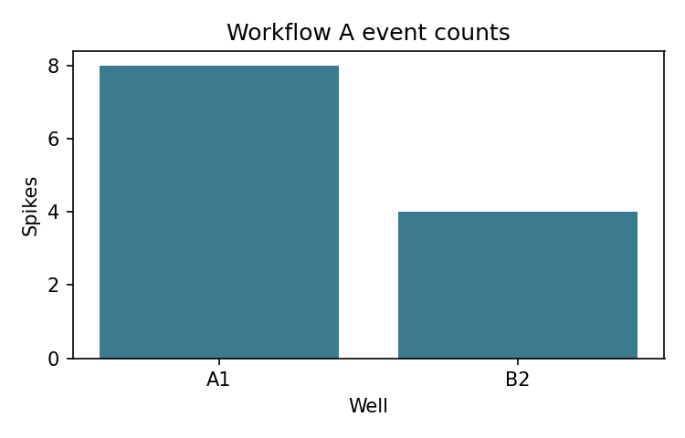

# Workflow A: Ingestion

Workflow A normalizes Axion spike CSV exports into canonical event tables and summary metrics. This
is the entry point for every downstream workflow.

## Inputs

```text
data/sample/workflow_a_axion_spikes.csv
```

Required Axion fields can use aliases such as `Time (s)`, `Timestamp`, `Electrode`, `Channel`, and
`Well`. Workflow A emits canonical `time_s`, `electrode`, and `well` columns.

```python
from meaorganoid.io import read_axion_spike_csv

events = read_axion_spike_csv("data/sample/workflow_a_axion_spikes.csv")
events.head()
```

## Run

```bash
meaorganoid process \
  --input data/sample/workflow_a_axion_spikes.csv \
  --output-dir outputs/workflow_a \
  --prefix workflow_a
```

## Outputs

```text
outputs/workflow_a/workflow_a_channel_summary.csv
outputs/workflow_a/workflow_a_well_summary.csv
outputs/workflow_a/workflow_a_run_metadata.json
outputs/workflow_a/workflow_a_input_metadata.json
```

Channel summary schema:

```text
well,electrode,spike_count,recording_duration_s,firing_rate_hz,isi_mean_s,isi_median_s,is_active
```



!!! note "Public API"
    Stable output filenames: `<prefix>_channel_summary.csv`,
    `<prefix>_well_summary.csv`, `<prefix>_run_metadata.json`, and
    `<prefix>_input_metadata.json`.
