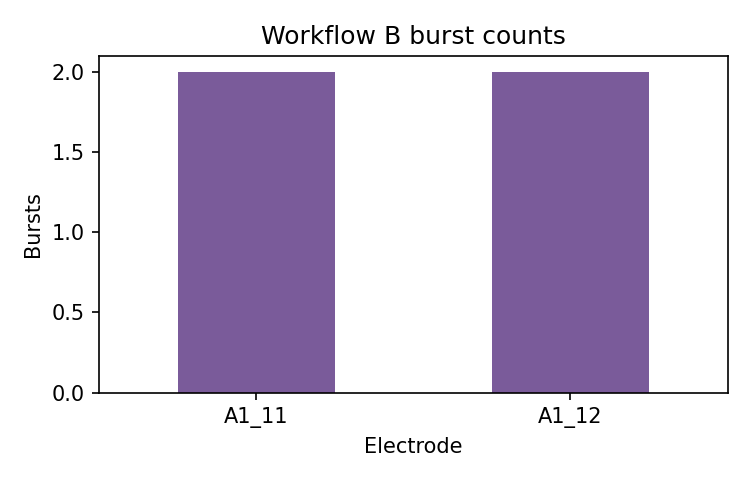

# Workflow B: Burst Detection

Workflow B detects single-electrode bursts from canonical spike events using ISI rules. Use it when
you need burst tables and per-channel burst summaries before raster or group-level analysis.

## Inputs

```text
data/sample/workflow_b_events.csv
```

```python
import pandas as pd
from meaorganoid.bursts import detect_bursts

events = pd.read_csv("data/sample/workflow_b_events.csv")
bursts = detect_bursts(events)
bursts[["well", "electrode", "start_s", "end_s", "n_spikes"]]
```

## Run

```bash
meaorganoid bursts \
  --input data/sample/workflow_b_events.csv \
  --output-dir outputs/workflow_b \
  --prefix workflow_b
```

## Outputs

```text
outputs/workflow_b/workflow_b_bursts.csv
outputs/workflow_b/workflow_b_burst_summary.csv
```

Burst table schema:

```text
well,electrode,burst_index,start_s,end_s,duration_s,n_spikes,mean_isi_s,intra_burst_rate_hz,method
```



!!! note "Public API"
    Stable output filenames: `<prefix>_bursts.csv` and `<prefix>_burst_summary.csv`.
