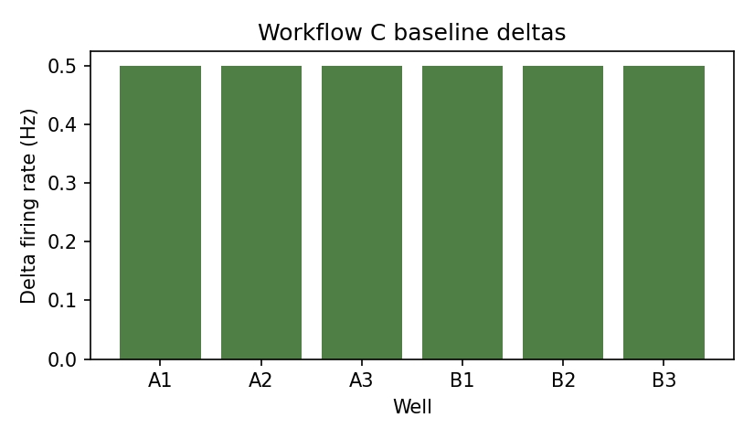

# Workflow C: Baseline Normalization

Workflow C compares paired wells across baseline and treatment conditions. It writes within-well
deltas and paired Wilcoxon statistics with Holm-corrected p-values.

## Inputs

```text
data/sample/workflow_c_well_summary.csv
```

```python
import pandas as pd
from meaorganoid.compare import compute_well_delta

summary = pd.read_csv("data/sample/workflow_c_well_summary.csv")
deltas = compute_well_delta(summary, baseline_label="baseline")
deltas.filter(regex="well|condition|delta").head()
```

## Run

```bash
meaorganoid compare-baseline \
  --input data/sample/workflow_c_well_summary.csv \
  --output-dir outputs/workflow_c \
  --prefix workflow_c \
  --baseline-label baseline

meaorganoid compare-conditions \
  --input data/sample/workflow_c_well_summary.csv \
  --output-dir outputs/workflow_c \
  --prefix workflow_c \
  --condition-a baseline \
  --condition-b treatment
```

## Outputs

```text
outputs/workflow_c/workflow_c_well_delta_from_baseline.csv
outputs/workflow_c/workflow_c_paired_condition_stats.csv
```



!!! note "Public API"
    Stable output filenames: `<prefix>_well_delta_from_baseline.csv` and
    `<prefix>_paired_condition_stats.csv`.
