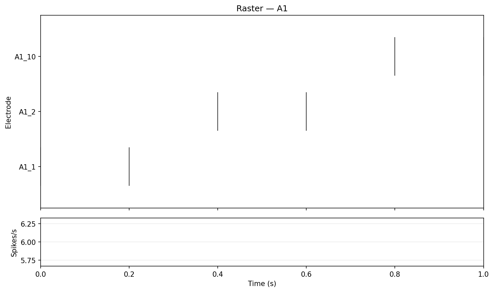

# Workflow D: NMT-Style Raster Plot

Workflow D renders spike rasters and population firing-rate traces per well. It mirrors the
inspection workflow researchers often perform in Axion's Neural Metric Tool.

## Inputs

```text
data/sample/workflow_d_events.csv
```

```python
import pandas as pd
from meaorganoid.plot.raster import plot_raster

events = pd.read_csv("data/sample/workflow_d_events.csv")
figure = plot_raster(events, well="A1")
```

## Run

```bash
meaorganoid plot-raster \
  --input data/sample/workflow_d_events.csv \
  --output-dir outputs/workflow_d \
  --prefix workflow_d \
  --format png
```

## Outputs

```text
outputs/workflow_d/workflow_d_raster_A1.png
outputs/workflow_d/workflow_d_raster_A2.png
```



!!! note "Public API"
    Stable output filename pattern: `<prefix>_raster_<well>.<fmt>`.
