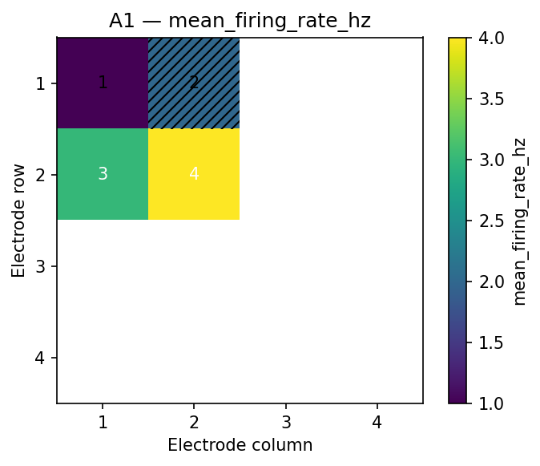

# Workflow E: Spatial Firing Heatmap

Workflow E maps per-channel metrics onto the well electrode grid. Use it to spot spatially localized
activity changes or inactive electrodes.

## Inputs

```text
data/sample/workflow_e_channel_summary.csv
```

```python
import pandas as pd
from meaorganoid.plot.spatial import plot_spatial_heatmap

channels = pd.read_csv("data/sample/workflow_e_channel_summary.csv")
figure = plot_spatial_heatmap(channels, well="A1")
```

## Run

```bash
meaorganoid plot-spatial \
  --input data/sample/workflow_e_channel_summary.csv \
  --output-dir outputs/workflow_e \
  --prefix workflow_e \
  --global-scale
```

## Outputs

```text
outputs/workflow_e/workflow_e_spatial_heatmap_A1.png
outputs/workflow_e/workflow_e_spatial_heatmap_B2.png
```



!!! note "Public API"
    Stable output filename pattern: `<prefix>_spatial_heatmap_<well>.<fmt>`.
