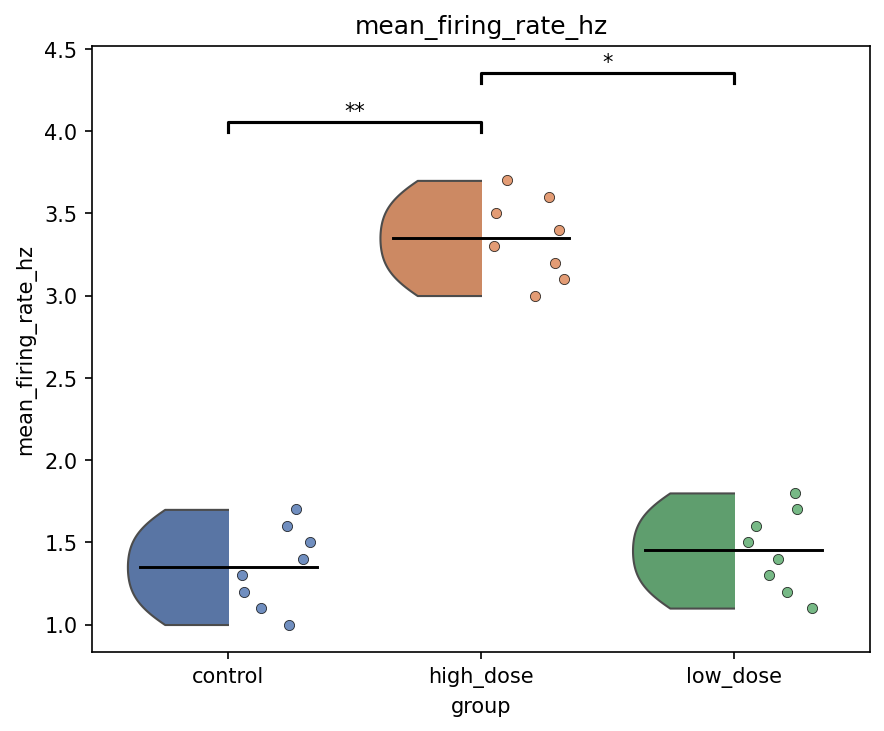

# Workflow F: Group Comparison

Workflow F compares well-level metrics across experimental groups and writes one tidy statistics
table plus one MEA-NAP-style group plot per metric.

## Inputs

```text
data/sample/workflow_f_well_summary.csv
```

```python
import pandas as pd
from meaorganoid.compare.group import compare_groups

summary = pd.read_csv("data/sample/workflow_f_well_summary.csv")
stats = compare_groups(summary, group_col="group")
stats.head()
```

## Run

```bash
meaorganoid compare-group \
  --input data/sample/workflow_f_well_summary.csv \
  --output-dir outputs/workflow_f \
  --prefix workflow_f \
  --group-col group \
  --metrics mean_firing_rate_hz,active_channel_count,burst_rate_hz
```

## Outputs

```text
outputs/workflow_f/workflow_f_group_comparison.csv
outputs/workflow_f/workflow_f_group_comparison_mean_firing_rate_hz.png
outputs/workflow_f/workflow_f_group_comparison_active_channel_count.png
outputs/workflow_f/workflow_f_group_comparison_burst_rate_hz.png
```

CSV schema:

```text
metric,group_a,group_b,n_a,n_b,median_a,median_b,statistic,p_raw,p_adj,significant,effect_size_r
```



!!! note "Public API"
    Stable output filenames: `<prefix>_group_comparison.csv` and
    `<prefix>_group_comparison_<metric>.png`.
