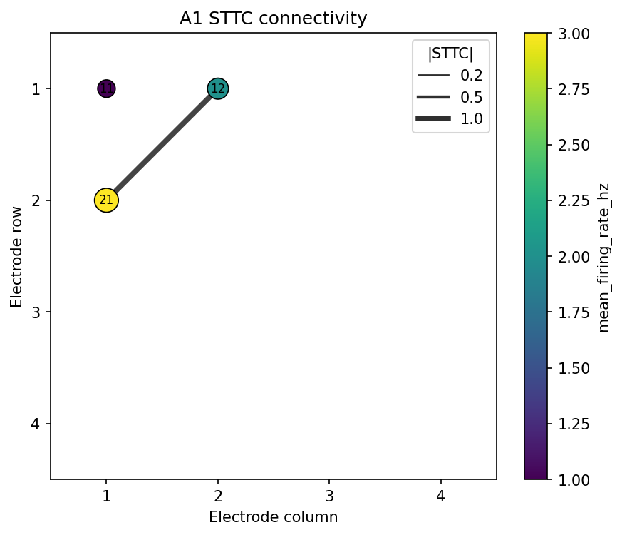

# Workflow G: Functional Connectivity

Workflow G computes STTC functional connectivity matrices from canonical spike events, thresholds
edges with circular-shift surrogates, and renders the network on the well electrode grid.

## Inputs

```text
data/sample/workflow_g_events.csv
data/sample/workflow_g_channel_summary.csv
data/sample/workflow_g_recording_manifest.csv
```

```python
import pandas as pd
from meaorganoid.connectivity import probabilistic_threshold

events = pd.read_csv("data/sample/workflow_g_events.csv")
adjacency, mask = probabilistic_threshold(
    events, well="A1", lag_s=0.05, recording_duration_s=2.0, n_iterations=50
)
adjacency.shape, mask.dtype
```

## Run

```bash
meaorganoid connectivity \
  --input data/sample/workflow_g_events.csv \
  --channel-summary data/sample/workflow_g_channel_summary.csv \
  --manifest data/sample/workflow_g_recording_manifest.csv \
  --output-dir outputs/workflow_g \
  --prefix workflow_g \
  --n-iterations 50
```

## Outputs

```text
outputs/workflow_g/workflow_g_connectivity_A1.png
outputs/workflow_g/workflow_g_connectivity_A1.npz
outputs/workflow_g/workflow_g_connectivity_B2.png
outputs/workflow_g/workflow_g_connectivity_B2.npz
```



!!! note "Public API"
    Stable output filenames: `<prefix>_connectivity_<well>.<fmt>` and
    `<prefix>_connectivity_<well>.npz`. The NPZ contains `adjacency`,
    `significance_mask`, `electrode_labels`, and `params`.
