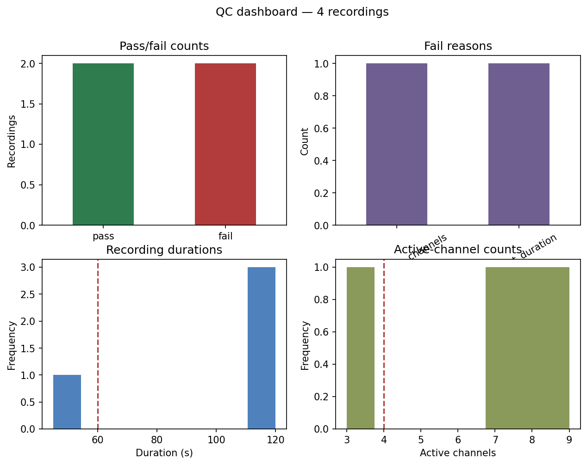

# Workflow H: QC Report

Workflow H adds QC flags to recording manifests and renders a dashboard summarizing pass/fail
status, common failure reasons, durations, and active-channel counts.

## Inputs

```text
data/sample/workflow_h_recording_manifest.csv
```

```python
import pandas as pd
from meaorganoid.qc import compute_qc_flags

manifest = pd.read_csv("data/sample/workflow_h_recording_manifest.csv")
qc = compute_qc_flags(manifest)
qc[["recording_id", "qc_status", "qc_reasons"]]
```

## Run

```bash
meaorganoid qc-report \
  --input data/sample/workflow_h_recording_manifest.csv \
  --output-dir outputs/workflow_h \
  --format png
```

## Outputs

```text
outputs/workflow_h/workflow_h_qc_dashboard.png
outputs/workflow_h/workflow_h_qc_summary.csv
```



!!! note "Public API"
    Stable QC output filenames: `<prefix>_qc_dashboard.<fmt>` and
    `<prefix>_qc_summary.csv`, where the prefix comes from the input manifest filename.
